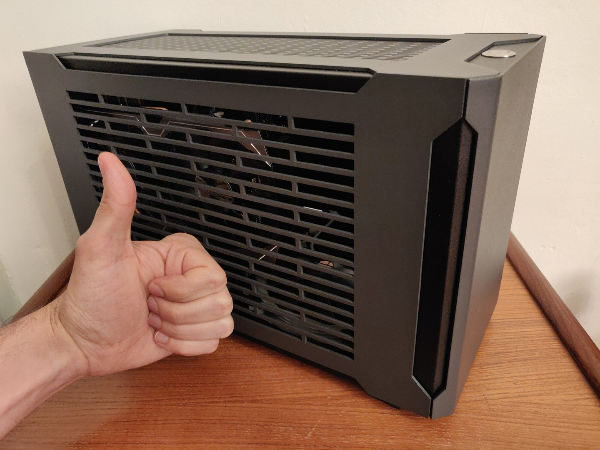
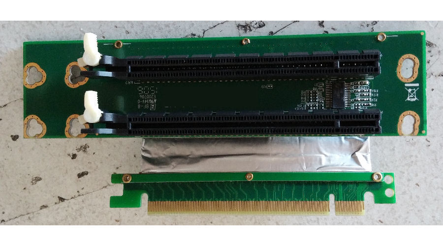
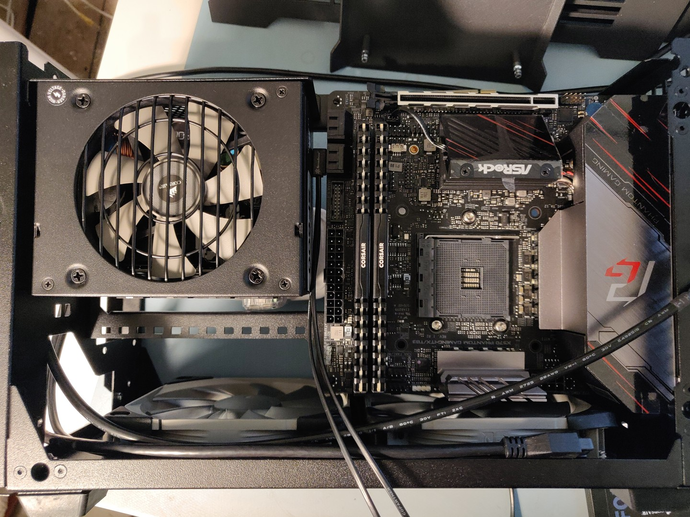
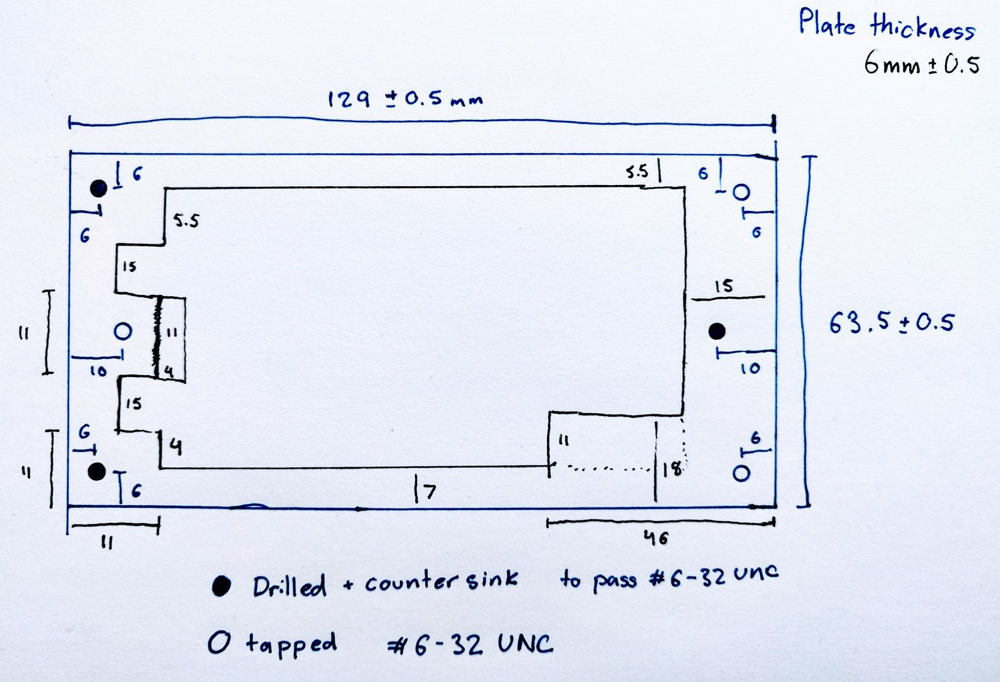
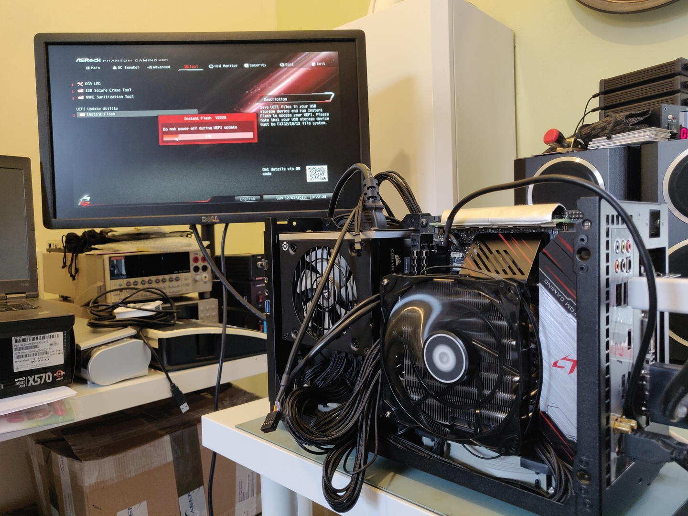
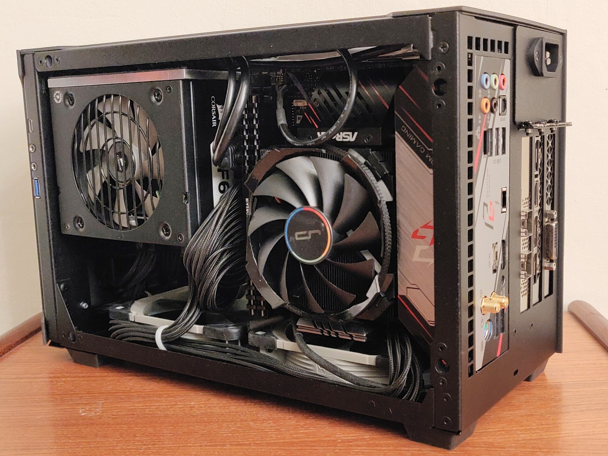
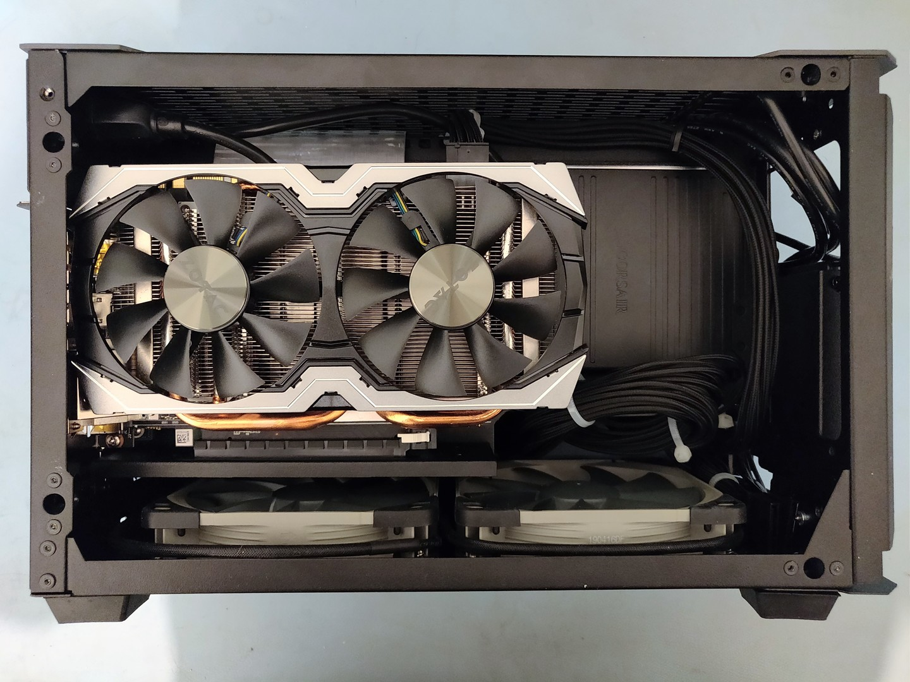

The increasing bandwidths of SDR hardware and computational demands of more complex digital communications protocols mean that my hardworking laptop (2013 Lenovo T440p) simply can't keep up with my needs. Now that I'm also doing increasing amounts of electromagnetic simulations for RF power amplifier design it was really time to get a desktop again.

I decided at the start of the process that I really wanted the PC to be as small as I could reasonably make it while keeping flexibility. The SDR hardware that I have meant that I needed at least two 10 Gigabit Ethernet SFP+ ports. I wanted to also develop for GPU and FPGA applications.

At this point I was looking for a tiny motherboard that had 10 GigE and lots of PCIe ports. Quickly I realized that it was either going to be very expensive server Mini ITX or use a consumer Mini ITX motherboard and pull some tricks to make it fit my exact goals.

AMD has (in fall 2019) been a pretty clear winner recently on performance/price. The Ryzen 3700X is an 8 core/16 thread 4.4 GHz CPU which only has a 65 Watt thermal design power, so pretty easy to cool in a small case. I was hoping that the 3900, 12 Core/24 thread 4.3 GHz 65 W TDP, would come out in time for the build but it's still unreleased (and intended for OEMs only) at this point. Ah well.

The X570 chipset has been fairly recently released and brings PCIe gen 4 support. Also, Intel has given in and made Thunderbolt available to AMD based designs! The Asrock X570 Phantom Gaming ITX/TB3 motherboard is the only ITX motherboard right now that has a Thunderbolt port. It has a single x16 PCIe slot and an M.2 slot with x4 PCIe support.

I hadn't known that it was possible to dynamically split PCIe lanes between multiple slots before. This is called PCIe Bifurcation and requires BIOS support for different configurations. The Asrock motherboard has x8x8 support which would allow two PCIe cards to run at x8 rates if installed in a physical riser board which electrically splits the lanes. This is more than enough speed for a 10 GigE NIC and a GPU to each run at full capacity.

Risers aren't that hard to come by, [Ameri-Rack](http://www.ameri-rack.com/ARC2-PELY423-C7_m.html) sells them and [C_Payne](https://peine-braun.net/shop/index.php?route=information/information&information_id=7) makes custom ones for the enthusiast market. What is tricky is the mechanical room and support for them in small cases. I had initially focused on the NCase M1 case which has room for three slot wide PCIe cards, but thankfully realized after a while that it was meant for a single very wide card and there's no room for a riser to be installed.

Sliger is another small PC case manufacturer which makes a range of cases which are "sandwich" layouts where the PCIe card(s) are separated from the motherboard and mounted parallel to the back of the motherboard. This keeps the case small while allowing for lots of room. In order to separate the PCIe card from the motherboard it already uses a riser. It turns out that they have Bifurcation in mind and have an option to upgrade to a 2 slot x8x8 riser, perfect!

The [Sliger SM560](https://www.sliger.com/products/cases/sm560/) case looked pretty good. It also looked quite tight. I had, at this point, found the SFF.Network forum and started reading up on other people's experiences with the SM560 and similar cases. One issue which was mentioned specifically with the Asrock motherboard is that the SATA connectors are right angled and pointing directly into where the SFX sized PSU is mounted. Ah. I looked around and found the [Silverstone CP11](https://www.silverstonetek.com/product.php?pid=445&area=en) thin, right angle SATA cables. I emailed Sliger asking if they thought this was fit and got a reply saying, effectively, "eh, maybe?!". Fair enough! I also looked hard at the PSU mount and it seemed there was some wiggle room there to shift the PSU towards the front of the case if needed. Since everything else looked like a good fit I decided at this point to jump and started buying components.

Part         | Selection  
---|---  
Case         | Sliger SM560 (vented sides)  
Motherboard  | Asrock X570 Phantom Gaming ITX/TB3  
CPU          | Ryzen 3700X  
CPU Cooler   | Cryorig C7G 
Memory       | Corsair Vengeance LPX DDR4-3200  
Video Card   | Sapphire RX 5700 XT Pulse  
Network Card | Mellanox ConnectX-4 Lx Dual 10 GigE SFP+  
Power Supply | Corsair SF600 W 80+ Platinum SFX  
Storage      | 1 TB Samsung 860 EVO SSD, 2 TB Seagate FireCuda Hybrid  
Case Fans    | 2x Noctua NF-P12 Redux PWM

As the parts started showing up I was eventually able to test fit the motherboard, PSU, and SATA cable. With the default mounting position it was a definite no-go, but with the PSU shifted 4 mm towards the front (actually touching a rivet on the inside of the front panel!) it just squeezes in. We're a **Go**!

Parts were still in shipment and the CPU cooler (more on that later) was stuck in customs so I had time to get a little shim board made. Thankfully the SFX mounting hole pattern is a published spec. Combined with some time spent with a caliper and some head scratching I drew this in Pencil CAD.

[Neil Smith](https://twitter.com/G4DBN) G4DBN is a friendly acquaintence who I've met a few times at the RSGB Convention and been an avid follower of on Twitter for a while now. He does really awesome metal working in his home shop and has volunteered in the past to do some work for the Cardiff University Amateur Radio Society. I reached out  with my sketch and he agreed to take on the job.

Fair to say he more than did justice to it. And if you look back at the Pencil CAD drawing and see the scratch out on the center left screw hole... that correction was done after he'd cut out the center pocket. I don't know what he did to fix that, but I definitely owe him a drink for it.

With that plate installed everything else could get installed into the case. At this point I actually had a different fan than the one listed above, the ID-Cooling IS-60. It ended up not fitting in any orientation and I thought I could use a saw to make it fit. As it turns out, no, that did not work. It was resting on top of the RAM and that 1mm of deflection was enough to make the side of the case not fit on.

So I swapped that cooler for the Cryorig C7G which fit perfectly. I repacked the case twice until I found a  cable routing that allowed everything to fit in. You can see the aluminum shim plate just above the PSU.

The two bottom fans are run exhausting hot air and the CPU, GPU, and PSU fans are drawing in fresh air. I plan on adding a 3D printed or laser cut acrylic fan shroud for the CPU as I've heard that can make a few degree difference and reduce turbulance noise a little. We'll see. Idle temperatures are all pretty good right now, ~30-40C and under load the CPU peaks around 75C. I'm hoping to pull that down a bit more with some tuning. It's definitely not loud, but with some adjustments to the fan curves I think it will be almost silent at idle without much temperature impact.

The GPU is currently a Zotac GTX 1070 that was available on loan. I'll upgrade to the AMD 5700 XT in the spring as it has much better OpenCL support and a FOSS driver stack.

There's an M.2 slot with PCIe x4 Gen 4 support. I'm hoping to install either an FPGA board such as the Aller Artix-7 or PicoEVB to do some GNU Radio development with.

That's all for now folks. During the build I was live posting this SFF.Network [Build Log](https://smallformfactor.net/forum/threads/travelling-itx-workstation-dual-10-gige-5700-xt-ryzen-3700x-in-sm560.11741/).
