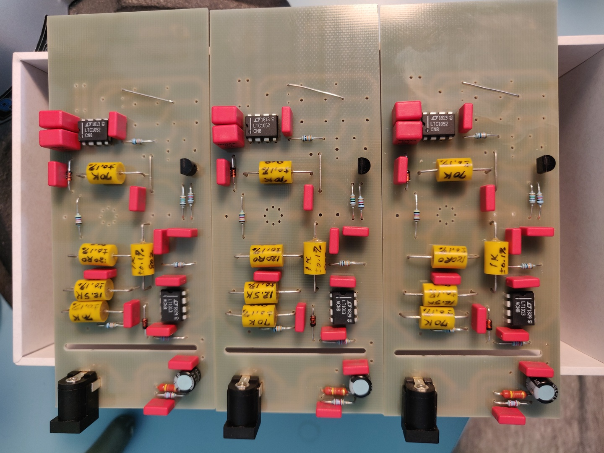
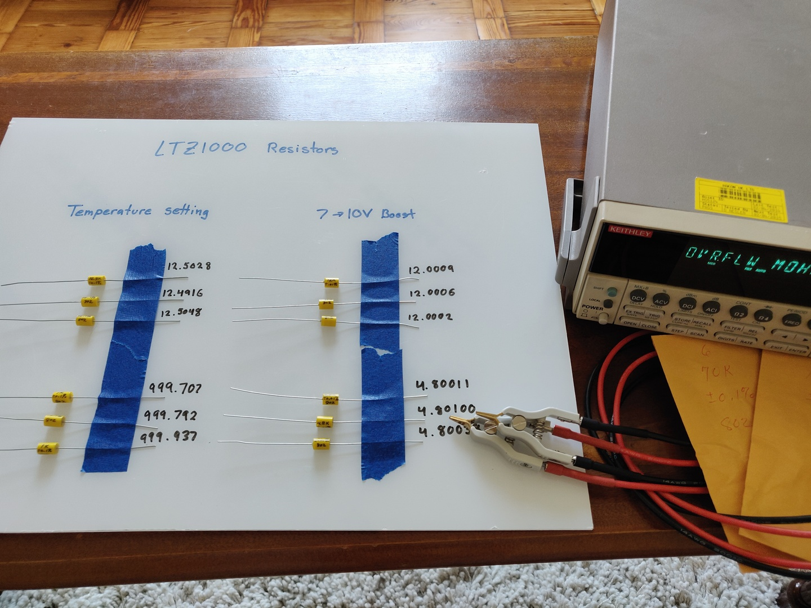
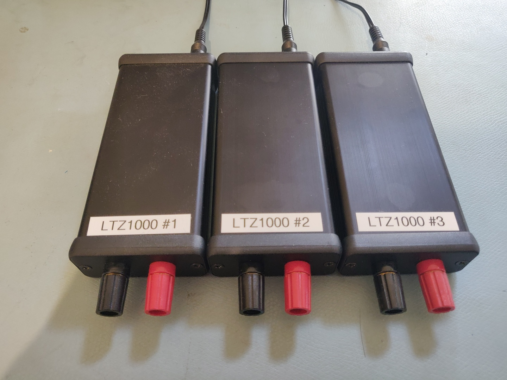

I'm building three voltage references based on the Analog Devices (Linear Tech) LTZ1000. The PCB design is by Branadic and the main LTZ1000 circuit is by Dr Frank, both from the EEVBlog Forum.

The resistors are precision wire wound resistors made by Edwin G. Pettis.

The completed references have been continuously running since March 2019, over 6,800 hours so far.

